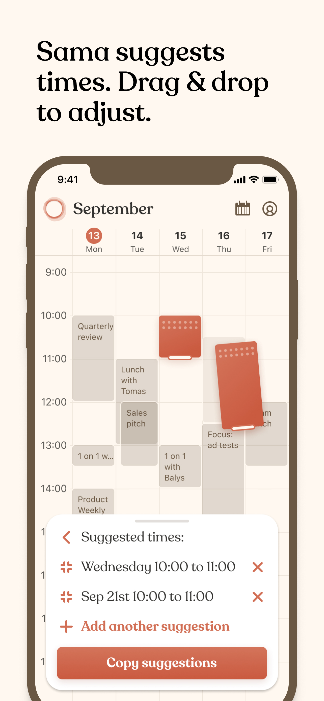
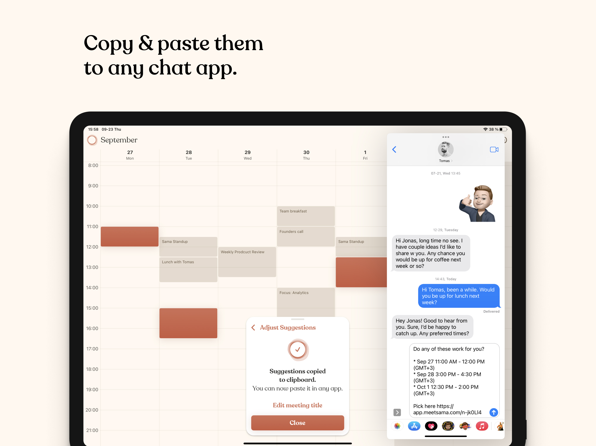

## Building

* run `./set-env.sh dev` which copies dev environment resources from `env/dev` folder to the app project directory
* click `Build` in xcode

## Licensing

The code is licensed under the Apache License, Version 2.0. See LICENSE for the full license text.
